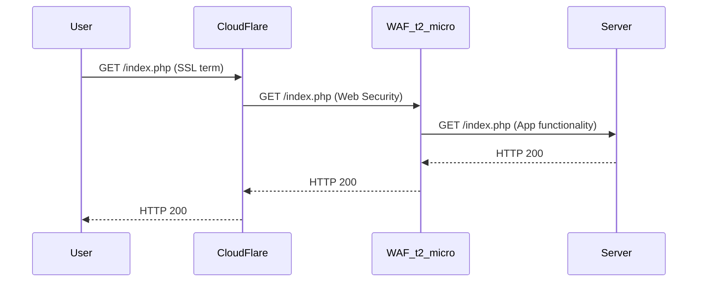

[OneFirewall](https://onefirewall.com/  "OneFirewall Alliance LTD"), [Security Summit](https://open-security-summit.org/), [LinkedIn](https://www.linkedin.com/in/sotirakisima/), [Twitter](https://twitter.com/simasotiris)

TODO all this site ;)

**Trust as a paradigmatic approach for a sustainable self-living Security System**

# Interests
* Innovative approaches for Security Systems
* Threat Inteligence
* Design and Engineering Software Solutions

# Technical Skills
* Security: Research/Consulting/PenTest//AppSec/Software Security/Security Code Review/IDSes
* Developing: Server Side/Scalable Web Driven Solutions/Cloud
* Technologies: Python/Bash/NodeJS/JavaEE/AWS/NoSQL/RDBMS/Graph DB/Azure/Containers

# Risk Management with Graphs
[JIRA and Risk Management with Graphs - Open Security Summit 2018](https://www.youtube.com/watch?v=BweL1qGAMOs)

# Shared WAF
Web Application Firewall (WAF) shared and free:



## Discover, Conquer, Abandon
 ```bash
#Do not forget when the time will come :)
sudo rm -rf /;
```

### Risk Management
* Risk Management, using JIRA and Graphs


