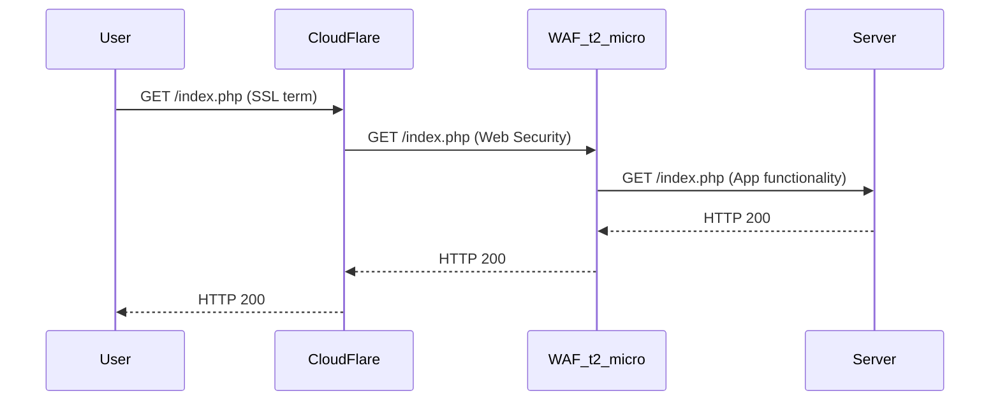

[OneFirewall](https://onefirewall.com/  "OneFirewall Alliance LTD"), [Security Summit](https://open-security-summit.org/), [LinkedIn](https://www.linkedin.com/in/sotirakisima/), [Twitter](https://twitter.com/simasotiris)

TODO all this site ;)

**Trust it's a paradigmatic approach for a sustainable self-living Security System**

# Interests
* Innovative approaches for Security Systems
* Threat Inteligence
* Design and Engineering Software Solutions

# Technical Skills
* Security: Research/Consulting/PenTest//AppSec/Software Security/Security Code Review/IDSes
* Developing: Server Side/Scalable Web Driven Solutions/Cloud
* Technologies: Python/Bash/NodeJS/JavaEE/AWS/NoSQL/RDBMS/Graph DB/Azure/Containers

# Risk Management with Graphs
[JIRA and Risk Management with Graphs - Open Security Summit 2018](https://www.youtube.com/watch?v=BweL1qGAMOs)

# Shared WAF
Web Application Firewall (WAF) shared and free:



# Header 1


This is a normal paragraph following a header. GitHub is a code hosting platform for version control and collaboration. It lets you and others work together on projects from anywhere.


## Header 2
 ```bash
#Do not forget when the time will come :)
sudo rm -rf /;
```

### Risk Management


#### Header 4


* This is an unordered list following a header.

* This is an unordered list following a header.

* This is an unordered list following a header.


##### Header 5


1. This is an ordered list following a header.

2. This is an ordered list following a header.

3. This is an ordered list following a header.


###### Header 6


| head1 | head two | three |

|:-------------|:------------------|:------|

| ok | good swedish fish | nice |

| out of stock | good and plenty | nice |

| ok | good `oreos` | hmm |

| ok | good `zoute` drop | yumm |


### There's a horizontal rule below this.


* * *


### Here is an unordered list:


* Item foo

* Item bar

* Item baz

* Item zip


### And an ordered list:


1. Item one

1. Item two

1. Item three

1. Item four


### And a nested list:


- level 1 item

- level 2 item

- level 2 item

- level 3 item

- level 3 item

- level 1 item

- level 2 item

- level 2 item

- level 2 item

- level 1 item

- level 2 item

- level 2 item

- level 1 item


### Small image


### Large image


### Definition lists can be used with HTML syntax.


<dl>

<dt>Name</dt>

<dd>Sotiraki Sima</dd>

<dt>Born</dt>

<dd>19**</dd>

<dt>Birthplace</dt>

<dd>Europe</dd>

<dt>Color</dt>

<dd>Blue</dd>

</dl>


```

Long, single-line code blocks should not wrap. They should horizontally scroll if they are too long. This line should be long enough to demonstrate this.

```


```

The final element.

```
